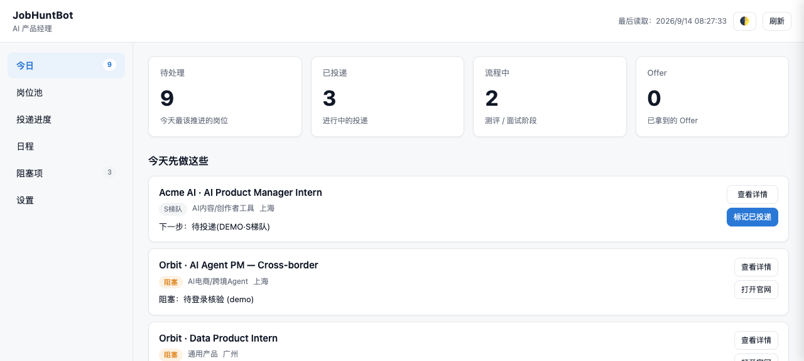

# JobHuntBot

**Turn your AI coding agent into a persistent job-search system — from industry-aware company research and benchmark JDs to a production-ready resume, live job matching, and application tracking.**

把 Codex / Claude Code 从“帮我改一次简历”，变成一个持续运行的完整求职系统。

[](LICENSE)


**中文说明 → [docs/README.zh-CN.md](docs/README.zh-CN.md)**



> Screenshot shows the bundled demo workspace (`examples/demo-workspace/`) — fictional companies only.

## What it does


JobHuntBot keeps state between the steps most tools treat as isolated: what the market actually asks for, what you can honestly prove, which companies matter in the chosen industry, which current roles pass hard gates, and what happened after you applied.

## Why JobHuntBot

| Typical AI job tool | JobHuntBot |
|---|---|
| Starts from one pasted JD | Starts from **role → industry → company tree → 5 benchmark official JDs** |
| Treats “big / mid / small” as headcount | Tiers companies relative to the **target industry and role** |
| Finds random startups | Has a dedicated **small-but-high-quality discovery + evidence gate** |
| Invents plausible-sounding experience | Builds an **evidence matrix** from real experience first |
| Produces only resume text | Produces structured resume content and, when tooling supports it, a **formatted DOCX template-based resume** |
| Ranks by keyword overlap | **Hard gates first**, then explainable 0–100 scoring |
| Quotes stale search results | Re-opens postings in a **real browser** for verification |
| Ends at “here are some links” | Opens a local **application dashboard** backed by your workspace |

## Features

### Industry-aware Role Intelligence
First identifies where the role exists, asks for the target industry, builds a three-layer company tree, then models the role from five benchmark JDs from head/benchmark companies.

### Company Tree
- Head / benchmark companies
- Growth / mid-size companies
- Small-but-high-quality / early high-quality companies

`assets/company-seeds.md` accelerates discovery but never acts as a permanent classification truth source.

### Small-but-high-quality Discovery
Uses official qualification lists, industry/regional rankings, venture/industry sources, and industry-specific signals, then applies an evidence-aware quality gate. One funding round, award, ranking, or government badge is never enough by itself.

### Evidence-based Production Resume
Capability model → verified experience → evidence matrix → STAR / reverse-STAR → standard one-page resume structure → truthfulness audit. The public DOCX template contains placeholders only and leaves the photo position blank.

### Live Job Matching
Returns to the Phase 1 company tree and verifies current openings in the correct campus/intern or experienced-hire channel.

### Local Application Workspace + Dashboard
All artifacts and job state live under `workspace/`. Phase 5 starts the existing dashboard and, when browser control is available, opens and verifies it instead of merely printing a localhost URL.

## Quick Start

```bash
git clone https://github.com/5JjiaLin/JobHuntBot.git
cd JobHuntBot
```

Then point your coding agent at the repo and say:

```text
Read AGENTS.md and SKILL.md.
Run JobHuntBot from the beginning. Do not skip phases.
```

The first visible question should only ask for your target role. Recruitment track is asked later, immediately before live job search.

### Dashboard only

```bash
npm run init:workspace -- "AI Product Manager"
node dashboard/server.js
# http://localhost:8420/dashboard.html
```

No database and no cloud service. The server binds to `127.0.0.1` only.

## Workflow & outputs

| Phase | What happens | Output |
|---|---|---|
| 1 | Role → industry → company tree → 5 benchmark JDs → capability model | `01_企业树.md`, `02_<行业><岗位>核心能力.md` |
| 2 | Verify or mine real experience | `03_个人经历.md` |
| 3 | Evidence matrix → resume → truthfulness audit | `04_证据矩阵.md`, `05_简历.md`, optional/available `05_简历.docx`, `06_简历审计.md` |
| 4 | Recruitment track → company tree → browser-verified openings → hard gate → S/A/B | `jobs.csv`, `07_投递优先级.md` |
| 5 | Validate workspace → start/open/verify dashboard | running local Dashboard |

Detailed playbooks live in `references/`; `SKILL.md` stays the execution contract rather than becoming a knowledge dump.

## Privacy

- `workspace/` is gitignored.
- Silent bootstrap must not scan `~/Downloads`, `~/Desktop`, `~/Documents`, Home, or unrelated projects for personal job-search files.
- External personal files are read only after the user supplies them or explicitly authorizes access in Phase 2.
- The public resume template contains placeholders, not personal identity data.
- The dashboard only talks to `127.0.0.1`; no telemetry or cloud component.
- The agent must not bypass logins, CAPTCHAs, permissions, or paywalls.

## Project structure

```text
JobHuntBot/
├── AGENTS.md
├── SKILL.md
├── assets/             # experience prompt, company seeds, resume template
├── dashboard/          # existing zero-dependency local dashboard
├── references/         # per-phase playbooks, loaded on demand
├── scripts/            # workspace scaffolding and tests
├── templates/          # CSV/table templates
├── docs/
├── evals/
├── examples/
└── workspace/          # your data, local + gitignored
```

## Credits

- **Yvonne He** — original ApplyPilot project.
- **DanielPan12** — JobHuntBot adaptation that carried the concept forward.
- **5JjiaLin** — rebuilt and integrated the current local-first workflow and dashboard.

See [LICENSE](LICENSE) for the copyright chain.

## License

[MIT](LICENSE)
