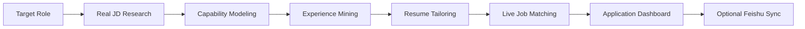

# JobHuntBot

**Turn your AI coding agent into a persistent job-search system — from JD research and resume tailoring to live job matching and application tracking.**

把 Codex / Claude Code 从“帮我改一次简历”，变成一个持续运行的完整求职系统。

[](LICENSE)


**中文说明 → [docs/README.zh-CN.md](docs/README.zh-CN.md)**


> Screenshot shows the bundled **demo workspace** (`examples/demo-workspace/`) — fictional companies only.

---

## What it does



Most AI job tools solve one step: rewrite a bullet point, draft a cover letter, or list openings. JobHuntBot is the surrounding system that keeps state between all of them — so the 50th application is informed by everything you learned in the first 49.

## Why JobHuntBot

| Typical AI job tool | JobHuntBot |
|---|---|
| Optimises one resume against one pasted JD | Models the role across **many companies' real, complete JDs** |
| Invents plausible-sounding experience | Builds an **evidence matrix** from your real experience first — no invented facts |
| Ranks by keyword overlap | **Hard gates first** (location / graduation year / work authorization), then explainable 0–100 scoring |
| Quotes stale search-engine results | Re-opens each posting in a **real browser** and verifies it is live right now |
| Chat history is the only memory | Everything lands in a **local workspace** you keep forever |
| Ends at "here are some links" | A dashboard where you actually **run the application pipeline** |

## Features

### Role Intelligence
Researches real JDs across a company pool (large / mid / small tiers) and distils core capabilities, hard gates, and common vs. plus skills.

### Evidence-based Resume
Experience facts → capability × evidence matrix → STAR / reverse-STAR → tailored resume → truthfulness audit.

### Live Job Matching
Goes back to the company pool and verifies openings in a real browser instead of quoting expired search results.

### Local Application Workspace
Jobs, applications, events and blockers live in plain CSV files under `workspace/` — readable, portable, and yours.

### Application Dashboard
Today's actions / job pool / pipeline / schedule / blockers, backed by a zero-dependency local server.

### Optional Feishu Sync (agent-assisted)
Optional, agent-assisted Local → Feishu mirror via the official `lark-cli`. The dashboard has **no built-in Feishu button** — sync, when wanted, is driven by an AI agent calling `lark-cli` against the local workspace. Your local workspace stays the single source of truth.

## Quick Start

```bash
git clone https://github.com/5JjiaLin/JobHuntBot.git
cd JobHuntBot
```

Then point your coding agent at the repo and say:

```text
Read AGENTS.md and SKILL.md.
Help me run JobHuntBot for "<target role>".
```

The agent will research the role, check your experience, build the resume, find current openings, scaffold a workspace, and start the dashboard.

Don't know what to provide? Just ask the agent to start from the beginning — it will ask only what is needed at each stage (target role first, recruitment type right before job search). You do **not** need to pre-fill your target role, recruitment type, experience, location, or graduation date up front.

### Dashboard only (no agent needed)

```bash
npm run init:workspace -- "AI Product Manager"
node dashboard/server.js
# open http://localhost:8420/dashboard.html
```

No dependencies to install, no database, no account. The server binds to `127.0.0.1` only.

To explore with sample data instead of an empty workspace, see [`examples/demo-workspace/`](examples/demo-workspace/).

## How it works

| Phase | What happens | Detail |
|---|---|---|
| 1 — Role Research | Build a company pool; read complete JDs across tiers; model capabilities and hard gates | [`references/role-research.md`](references/role-research.md) |
| 2 — Experience Evidence | Mine and verify your real experience — the agent offers a copy-to-GPT prompt or does it live in-session (socratic, one question at a time) | [`references/experience-input.md`](references/experience-input.md) |
| 3 — Resume Tailoring | Evidence matrix → STAR → resume → fact/number/ownership audit | [`references/resume-engine.md`](references/resume-engine.md) |
| 4 — Live Job Matching | Browser-verified current openings; hard gate → score → S/A/B | [`references/job-matching.md`](references/job-matching.md) |
| 5 — Application Workspace | Write jobs into the workspace; track pipeline, events and blockers | [`references/application-workspace.md`](references/application-workspace.md) |

`SKILL.md` is the agent's behaviour contract; the README stays a product overview on purpose.

## Privacy

- `workspace/` is gitignored — your real job pool, notes and resumes never leave your machine.
- The dashboard only talks to `127.0.0.1`; there is no telemetry and no cloud component.
- Feishu credentials are owned by the official `lark-cli`; JobHuntBot never stores App Secrets or OAuth tokens.
- The agent must not bypass logins, CAPTCHAs or paywalls — restricted pages are marked `Needs user`.
- Resumes are generated from your verified experience; invented facts are treated as a defect, not a feature.

## Supported agents

**Best experience:** OpenAI Codex · Claude Code

Any agent that can read repo files, run shell commands, edit files and control a browser can drive the workflow.

## Project structure

```text
JobHuntBot/
├── AGENTS.md            # how an agent should operate this repo
├── SKILL.md             # the end-to-end job-search skill
├── dashboard/           # zero-dependency local web dashboard
├── references/          # per-phase playbooks the agent loads on demand
├── scripts/             # workspace scaffolding, job-id tooling, security test
├── templates/           # empty workspace tables
├── docs/                # guides, data contract, 中文 README
├── examples/            # demo workspace (fictional data)
└── workspace/           # your data — local, gitignored
```

## Credits

JobHuntBot is a fork-and-rebuild lineage, and this project would not exist without its predecessors:

- **Yvonne He** — original **ApplyPilot** project.
- **DanielPan12** — the **JobHuntBot** adaptation that carried the concept forward and shaped the current workflow.
- **5JjiaLin** — merged the Core pipeline with a rebuilt dashboard, hardened the local server, moved all writes to stable `job_id`s, and prepared this open-source release.

See [`LICENSE`](LICENSE) for the full copyright chain.

## License

[MIT](LICENSE) © Yvonne He, DanielPan12 and JobHuntBot contributors.
