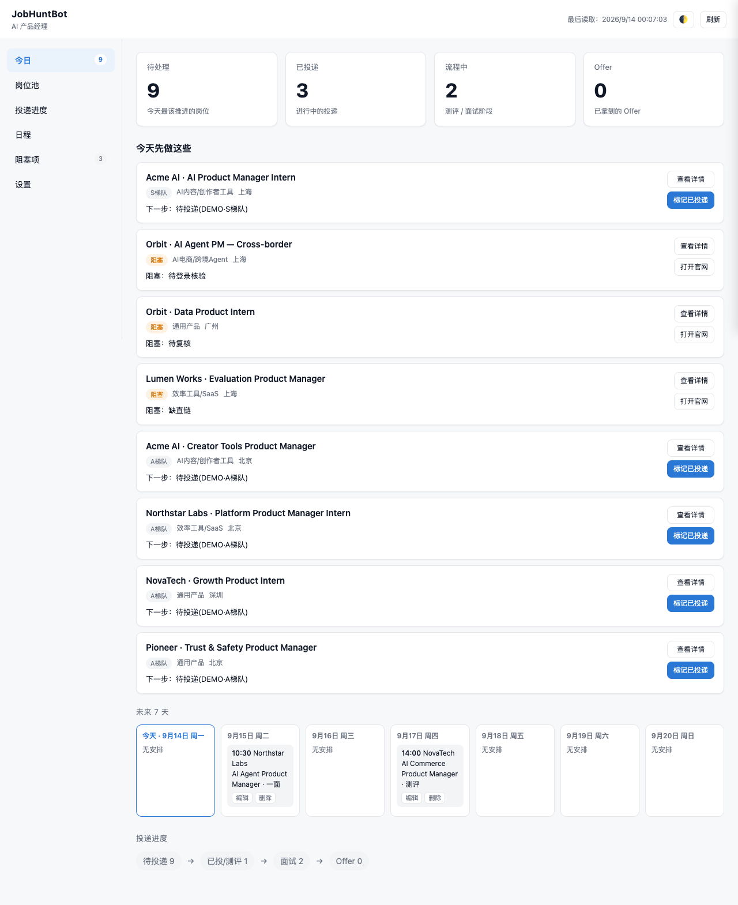

# JobHuntBot

[English](../README.md) · 中文

**把 Codex / Claude Code 从“帮我改一次简历”，变成一个持续运行的完整求职系统。**

从目标岗位研究、定制简历，到实时找岗与投递跟踪——JobHuntBot 让 AI 编程助手在所有环节之间保持上下文。



> 截图来自内置的 **demo 工作区**（`examples/demo-workspace/`），公司、岗位、事件全部为虚构数据。

---

## 它做什么


大多数 AI 求职工具只解决单点问题：改一条 bullet、写一封 Cover Letter、列一批职位。JobHuntBot 补的是这些环节之间**持续存在的状态**——所以第 50 次投递，能带着前 49 次学到的所有东西。

## 为什么是 JobHuntBot

| 常见 AI 求职工具 | JobHuntBot |
|---|---|
| 对着一条贴进来的 JD 优化一份简历 | 跨**多家公司的真实完整 JD** 建模岗位能力 |
| 编造听起来合理的经历 | 先从你的真实经历建立**证据矩阵**，不编事实 |
| 按关键词重合度排序 | **Hard Gate 先判断**（地点/届别/资格），再给可解释的 0–100 分 |
| 引用过期的搜索结果 | 用**真实浏览器**重新打开每条岗位，验证此刻是否在招 |
| 聊天记录就是全部记忆 | 一切落在**本地 Workspace**，长期保存 |
| 到“这里有一些链接”为止 | 一个真正用来**跑投递流程**的看板 |

## 核心功能

- **Role Intelligence** — 研究公司池（大厂/中厂/小厂梯队）的真实 JD，提炼核心能力、Hard Gates、Common/Plus Skills。
- **Evidence-based Resume** — 经历事实 → 能力×证据矩阵 → STAR / 反向 STAR → 定制简历 → 真实性审计。
- **Live Job Matching** — 回到公司池用浏览器验证当前在招岗位，而不是引用过期摘要。
- **Local Application Workspace** — 岗位、投递、日程、阻塞项全部存在本地 CSV，可读、可迁移、属于你。
- **Application Dashboard** — 今日行动 / 岗位池 / 投递进度 / 日程 / 阻塞项，零依赖本地服务驱动。
- **可选飞书同步（由 AI Agent 调用官方 lark-cli）** — 将本地岗位池单向镜像到飞书多维表格；Dashboard 无内置飞书按钮，本地始终是唯一真源。

## 快速开始

```bash
git clone https://github.com/5JjiaLin/JobHuntBot.git
cd JobHuntBot
```

然后把仓库交给你的编码助手，说：

```text
Read AGENTS.md and SKILL.md.
Help me run JobHuntBot for "<target role>".
```

Agent 会研究岗位、核验经历、生成简历、找当前在招岗位、初始化工作区并启动看板。

### 只用看板（不需要 Agent）

```bash
npm run init:workspace -- "AI 产品经理"
node dashboard/server.js
# 打开 http://localhost:8420/dashboard.html
```

无需安装依赖、无数据库、无账号；服务只绑定 `127.0.0.1`。

想先看示例数据再跑真实流程，见 [`../examples/demo-workspace/`](../examples/demo-workspace/)。

## 工作流程

| 阶段 | 内容 | 详细规则 |
|---|---|---|
| 1 — 岗位研究 | 建公司池；跨梯队读完整 JD；建模能力与 Hard Gate | [`../references/role-research.md`](../references/role-research.md) |
| 2 — 经历证据 | 挖掘并核验真实经历（没有材料时提供深挖 Prompt） | [`../references/experience-input.md`](../references/experience-input.md) |
| 3 — 定制简历 | 证据矩阵 → STAR → 简历 → 事实/数字/权责审计 | [`../references/resume-engine.md`](../references/resume-engine.md) |
| 4 — 实时找岗 | 浏览器核验当前在招；Hard Gate → 评分 → S/A/B | [`../references/job-matching.md`](../references/job-matching.md) |
| 5 — 投递工作区 | 岗位写入工作区；跟踪流程、日程与阻塞项 | [`../references/application-workspace.md`](../references/application-workspace.md) |

## 隐私

- `workspace/` 已被 gitignore——真实岗位池、笔记与简历不会离开你的电脑。
- 看板只与 `127.0.0.1` 通信；无埋点、无云组件。
- 飞书凭据由官方 `lark-cli` 管理，JobHuntBot 不保存 App Secret 或 OAuth token。
- Agent 不得绕过登录、验证码或付费墙——受限页面统一标记 `Needs user`。
- 简历只从已核验的经历生成；编造事实被视为缺陷而非功能。

## 适用 Agent

**最佳体验：** OpenAI Codex · Claude Code

任何能读仓库文件、执行 shell、编辑文件并控制浏览器的 AI 编码助手都可以驱动这套流程。

## 目录结构

```text
JobHuntBot/
├── AGENTS.md            # Agent 操作本仓库的规范
├── SKILL.md             # 端到端求职 Skill
├── dashboard/           # 零依赖本地 Web 看板
├── references/          # 各阶段 playbook（按需加载）
├── scripts/             # 工作区脚手架、job_id 工具、安全测试
├── templates/           # 空工作区表模板
├── docs/                # 指南、数据契约、英文 README
├── examples/            # demo 工作区（虚构数据）
└── workspace/           # 你的数据——本地、gitignored
```

## Credits

JobHuntBot 是一条 fork-再构建的谱系，没有前作就没有这个项目：

- **Yvonne He** — 原始 **ApplyPilot** 项目。
- **DanielPan12** — **JobHuntBot** 改编版，延续概念并塑造了当前流程。
- **5JjiaLin** — 将 Core 流水线与重建的看板合并，加固本地服务，把所有写操作迁移到稳定 `job_id`，并完成本次开源整理。

完整版权链见 [`../LICENSE`](../LICENSE)。

## License

[MIT](../LICENSE)
